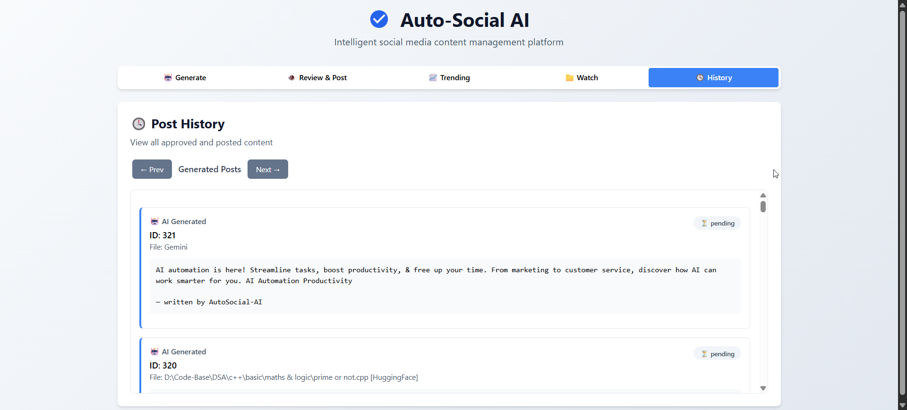

# AutoSocial AI

AutoSocial AI is a Python automation project that helps you create social media posts or blog content based on your local development work. It watches a folder (like your codebase), detects updates, and generates content that can be posted to platforms like Twitter (X), LinkedIn, or your personal website.


---

## 👤 Author

**Priyanshu Saini**

[](https://www.linkedin.com/in/priyanshu-saini-4b4a0a28a/)
[](https://twitter.com/Dev_Priyanshu_1)
[](https://linktr.ee/Priyanshu_Saini2005)

📧 **Email:** [Priyanshusaini9991@gmail.com](mailto:Priyanshusaini9991@gmail.com)  
📄 [Resume (PDF)](https://docs.google.com/document/d/1_LnjZy7qLLiSqB8eeqibY--Ht0c948B17oVZr9wiS1c/edit?usp=sharing)

---

## 🚧 Project Status

This project is currently in completed.

---

## ✨ Features

- Monitors a folder for file changes  
- Generates text content using AI (multiple models: ChatGPT, Gemini, Llama)  
- Can create short posts (e.g. Twitter, LinkedIn) or long posts (e.g. blogs)  
- Can post to multiple platforms  
- Option to post instantly or on a schedule  
- Session-based summaries for grouped changes  
- Custom content submission and approval workflow

---

## ⚙️ How It Works

1. You give AutoSocial AI access to your project folder.  
2. It monitors file changes and detects updates.  
3. Based on the changes, it generates a post like:
4. It then posts this content to Twitter, LinkedIn, or your portfolio.

<!-- Replace the below with your actual workflow image -->





---

## 🚀 Getting Started

### 1. Clone the repository

```bash
git clone https://github.com/yourusername/autosocial-ai.git
cd autosocial-ai
```

### 2. Install dependencies

```bash
pip install -r requirements.txt
```

### 3. Run the backend server

```bash
uvicorn main:app --reload
```
  > Then open your browser and visit:
  > http://localhost:8000/

---

## 🔧 Configuration

Before running the backend, create a `.env` file in the project root (or set environment variables) with your API keys and other settings.  
**Required variables:**

```env
OPENAI_API_KEY=
GEMINI_API_KEY=
GROQ_API_KEY=
DATABASE_URL=
HF_API_KEY=

# --- Social Media API Tokens ---
X_BEARER_TOKEN=
X_CONSUMER_KEY=
X_CONSUMER_SECRET=
X_ACCESS_TOKEN=
X_ACCESS_TOKEN_SECRET=

# --- LinkedIn API Tokens ---
LINKEDIN_ACCESS_TOKEN=
LINKEDIN_ORGANIZATION_URN=
LINKEDIN_AUTHOR_URN=
LINKEDIN_CLIENT_ID=
LINKEDIN_CLIENT_SECRET=
LINKEDIN_REDIRECT_URI=

# --- App Secret ---
SECRET_KEY=
```

---

## 🛠️ Usage

- Configure your `.env` file with the required API keys.
- Start the backend server.
- Use the FastAPI docs at [http://localhost:8000/](http://localhost:8000/) to interact with the API.
- The backend will monitor your specified folder for changes and generate/post content automatically.
- Approve, edit, or reject generated posts via the API endpoints.

---

## 🛣️ Roadmap Ahead

- Blog publishing support  
- More platform integrations  
- Post templates and customization  
- Analytics and notifications  

---

## 📄 License

This project is licensed under the MIT License. See the [LICENSE](LICENSE) file for details.
